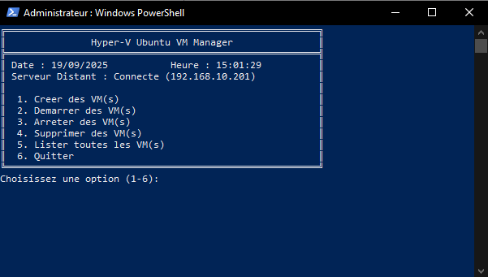

# 💻 Hyper-V Ubuntu VM Deployer with Cloud-Init

Scripts PowerShell pour provisionner des VMs Linux sur Hyper-V avec cloud-init (datasource NoCloud)

Un outil PowerShell automatisé pour déployer dynamiquement des machines virtuelles Ubuntu sur un hôte **Hyper-V distant**, avec configuration réseau **statique via cloud-init** ou **dynamique DHCP**, selon des paramètres définis dans un fichier de conf.

---

## 🧭 Objectif

Ce projet permet de :

- Créer automatiquement des VMs Ubuntu sur un hôte Hyper-V distant
- Utiliser un **VHDX parent** et créer un **disque différencié par VM**
- Générer un **ISO cloud-init** par VM (hostname, réseau, packages, etc.)
- Définir une **IP fixe** et un nom d’hôte (**ou laisser DHCP**)
- Démarrer la VM prête à l’emploi (**Hyper-V Gen2**, **Secure Boot désactivé** pour Ubuntu)
---

## ⚙️ Fonctionnalités

- ✅ Déploiement distant (**WinRM / PowerShell Remoting**)
- ✅ Fichiers cloud-init générés (CIDATA) : `user-data`, `network-config`, `meta-data`
- ✅ Attribution d’IP statique via `config.psd1` (IpTemplate + PoolStart) ou DHCP
- ✅ Création `ISO CIDATA` avec `oscdimg.exe` (Windows ADK), montage automatique
- ✅ Compatible **Hyper-V Generation 2** + Ubuntu (cloud-init présent dans l’image)

---

## 📂 Arborescence simplifiée

├─ deploy_vms_remote.ps1        # Menu/driver : charge la conf, sélectionne, orchestre la création\
├─ CreateVmRemote.ps1           # Création d’UNE VM (remoting Hyper-V) + appel ISO\
├─ Create_Iso_Cidata.ps1        # Génération de l’ISO cloud-init (NoCloud, label CIDATA)\
├─ config.psd1                  # Fichier de configuration (hôte, chemins, réseau, défauts, scripts)\
├─ img/\
│  └─ screen_presentation_readme.png\
└─ README.md\
---

## 📋 Prérequis

- Windows Server / 10/11 avec Hyper-V sur l’hôte distant
- PowerShell Remoting activé (WinRM) et droits admin sur l’hôte distant
- Un VHDX parent Ubuntu avec cloud-init (chemin défini dans config.psd1) : **INSERER ICI PLUS TARD DES CHEMINS POUR TROUVER CES VHDXs**
- L'outils de création d'iso [`oscdimg.exe`] installé, fourni avec le Windows ADK (Assessment and Deployment Kit).(https://learn.microsoft.com/fr-fr/windows-hardware/get-started/adk-install)
- Un switch Hyper-V existant et connecté (ex : `vSwitch-EXT1`)
- Accès admin sur l’hôte distant
- Out-GridView pour une sélection graphique des paquets
(Install-Module Microsoft.PowerShell.GraphicalTools -Scope CurrentUser\
Import-Module Microsoft.PowerShell.GraphicalTools )

Windows ADK installé (pour oscdimg.exe) — renseigne son chemin dans config.psd1

Un vSwitch Hyper-V existant (ex. vSwitch-EXT1)

(Optionnel) Out-GridView pour une sélection graphique des paquets

---

## 🚀 Démarrage rapide
1. Installer le Windows ADK (pour oscdimg.exe) et renseigner son chemin dans config.psd1.
2. Configurer config.psd1 (hôte distant, chemins, réseau, switch, etc.).
3. Lancer : `.\deploy_vms_remote.ps1`
4. Choisir 1. Créer des VM(s) → saisir le nombre, la RAM, le préfixe (ex. ServeurWEB → TST_ServeurWEB-01).
5. Sélectionner des packages à installer via cloud-init (Out-GridView).
6. Le script: 
	- calcule l’IP si STATIC (IpTemplate + PoolStart),
	- génère l’ISO (<VMName>.iso, label CIDATA) dans IsoPath,
	- crée la VM (diff VHDX, Gen2, SecureBoot off), monte l’ISO, démarre la VM.